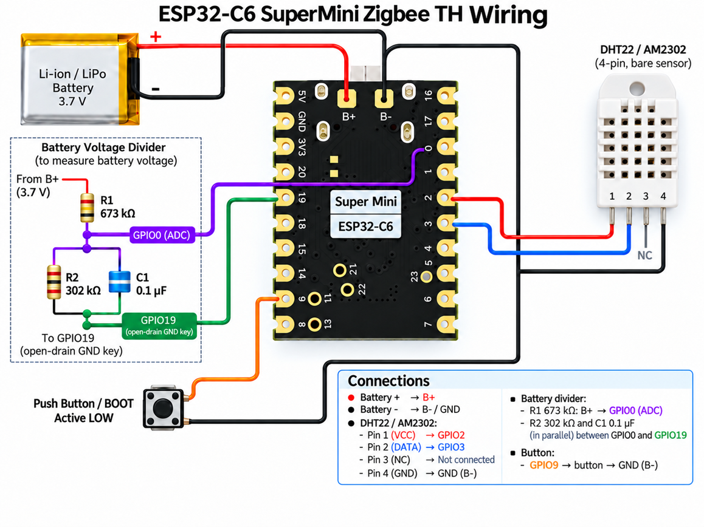

# ESP32-C6 Zigbee TH: схема подключения

Плата: **ESP32-C6 SuperMini (MakerGO)**. Датчик: **DHT22 / AM2302 без платы**. Питание — один Li-ion/LiPo аккумулятор через площадки `B+` и `B-`.

## Подключение

| Узел | Подключение | Режим в прошивке |
| :--- | :--- | :--- |
| Аккумулятор `+` | `B+` | Питание платы и верхнее плечо делителя |
| Аккумулятор `-` | `B-` / `GND` | Общая земля |
| DHT22 VCC, pin 1 | `GPIO2` | Коммутируемое питание |
| DHT22 DATA, pin 2 | `GPIO3` | Внутренняя pull-up включена только на время замера |
| DHT22 NC, pin 3 | Не подключать | — |
| DHT22 GND, pin 4 | `GND` | Общая земля |
| Делитель батареи | `GPIO0` | ADC, attenuation `6db` |
| Ключ земли делителя | `GPIO19` | Open-drain; при замере притягивается к GND |
| Кнопка | `GPIO9` → `GND` | Внутренняя pull-up, active LOW, источник пробуждения |
| Синий LED | `GPIO15` | Индикация join, reset и ожидания Zigbee TX |

Штатный WS2812 на `GPIO8` демонтирован для снижения потребления.

## Схема



```text
Li-ion + / B+
     |
   R1 673 кОм
     |
     +-------------------------- GPIO0 (ADC)
     |
     +---- R2 302 кОм ----+
     |                     |
     +---- C1 0.1 мкФ -----+---- GPIO19 (open-drain GND key)


DHT22 / AM2302

pin 1 VCC  --------------------- GPIO2
pin 2 DATA --------------------- GPIO3
pin 3 NC   --------------------- не подключать
pin 4 GND  --------------------- GND


BOOT / внешняя кнопка

GPIO9 -------------------------- кнопка ---------------- GND
```

`R2` и `C1` подключаются параллельно между `GPIO0` и `GPIO19`. Верхний резистор `R1` идёт от `B+` к `GPIO0`. Калибровочный коэффициент ADC в текущем YAML — `3.2228`.

## Цикл измерения

При каждом обычном и кнопочном замере прошивка:

1. Включает pull-up `GPIO3`, питание DHT22 через `GPIO2` и ключ делителя через `GPIO19`.
2. Удерживает `GPIO2` и `GPIO19` в автоматическом Light Sleep в течение 2 секунд; Zigbee-задача в это время не блокируется.
3. Читает DHT22, напряжение батареи и uptime. Процент батареи рассчитывается из измеренного напряжения.
4. Отключает питание DHT22 и делитель, затем снимает pull-up/pull-down с `GPIO3`.
5. Собирает переменный Zigbee batch-пакет: неизменившиеся и недоступные значения не занимают место.
6. Ждёт локальный TX confirm не более 3 секунд и завершает прикладное ожидание даже при timeout.

Обычный период замеров — 10 минут по монотонному дедлайну `esp_timer_get_time()`, привязанному к моменту присоединения к сети для совмещения с десятиминутным Zigbee keepalive. После передачи блокируется только основной FreeRTOS-task ESPHome до этого дедлайна; Zigbee-task продолжает обслуживать keepalive, потерю родителя и rejoin. Когда задачам нечего выполнять, ESP-IDF автоматически держит процессор в tickless Light Sleep. Периодического запуска ESPHome loop каждые 65.535 секунды нет. Кнопка прерывает ожидание, но кнопочный замер не сдвигает обычный десятиминутный график: после него устройство досыпает остаток исходного периода. Keepalive явно установлен в 10 минут. ED timeout отдельно не переопределяется и остаётся равным дефолтным для ESPHome 64 минутам. После первого присоединения к сети устройство остаётся бодрствующим 30 секунд после отпускания кнопки для interview.

## Кнопка GPIO9

- Короткое нажатие во время основного сна: пробуждение и один полный замер.
- Удержание 8 секунд: `zigbee.factory_reset` и пять быстрых вспышек LED.
- Нажатие во время активного цикла joined-устройства не обрабатывается.
- Удержание при включении питания остаётся аппаратным входом в bootloader.

GPIO9 обслуживается one-shot level interrupt: первое срабатывание немедленно отключает IRQ, через 20 мс проверяется устойчивый уровень, после чего прерывание перевооружается на противоположный уровень. Поэтому удерживаемая кнопка не создаёт interrupt storm. На время обязательного двухсекундного прогрева DHT22 GPIO wake и IRQ временно отключаются.

## Zigbee

Все ESPHome sensors внутренние и не создают отдельные Zigbee reports или дополнительные endpoints. Данные уходят одной командой:

| Параметр | Значение |
| :--- | :--- |
| Source endpoint | `1` |
| Destination | coordinator `0x0000`, endpoint `1` |
| Data server cluster | `0xFC01` |
| Diagnostic server cluster | `0xFC02` |
| Command | `0x00` |
| Payload | переменная длина, bitmap присутствия + значения |
| Default Response | отключён |

Порядок и целочисленные типы полей задаются параметром `zigbee_batch.data` в YAML. Перед каждой отправкой скетч вызывает `begin()`, затем `add(value)` или `skip()` для полей в порядке объявления и в конце `send()`. Неуказанные поля в конце структуры автоматически считаются пропущенными. Поэтому при текущих шести полях последовательность `begin(); send();` отправляет единственный bitmap-байт `0x00`.

В начале payload находятся bitmap-байты. Биты 0–6 показывают наличие соответствующих семи полей, бит 7 показывает, что за текущим bitmap следует ещё один. Все bitmap-байты идут подряд, затем подряд идут только присутствующие значения в порядке объявления `data`. Целые числа кодируются little-endian.

Текущая структура:

| Поле | Тип | Преобразование |
| :--- | :--- | :--- |
| temperature | `int16_t` | °C × 100 |
| humidity | `uint16_t` | % × 100 |
| battery voltage | `uint16_t` | V × 1000 |
| battery % | `uint8_t` | без масштаба |
| uptime | `uint32_t` | секунды |
| previous TX wait | `uint16_t` | миллисекунды |

Компонент хранит последнее успешно подтверждённое закодированное значение каждого поля в RAM. Повторяющееся значение автоматически получает нулевой бит и не включается в payload. После перезагрузки кеш пуст, поэтому первая успешная попытка содержит все доступные поля. Для недоступного значения вызывается `skip()`; в частности, первый пакет после загрузки не содержит previous TX wait.

Первая ошибка сохраняется во flash и не затирается последующими ошибками. Для каждого нового сохранённого события увеличивается постоянный 32-битный счётчик. После следующей успешной основной передачи прошивка один раз отправляет отдельную семибайтовую диагностическую команду через cluster `0xFC02`. Ошибка очищается во flash только после успешного TX confirm диагностической команды; счётчик при этом сохраняется.

Диагностический payload version `2` не изменился: version (1 байт), error code little-endian (2 байта) и persistent error sequence little-endian (4 байта). Converter публикует поля `error` и `error_sequence`, а старый трёхбайтовый диагностический payload version `1` продолжает принимать для совместимости. Коды `61001`–`61255` означают статусы TX confirm. Для `61008` converter публикует более точное имя `ERROR_TARGET_ADDRESS_UNALLOCATED`.

`ERROR_CONFIRM_TIMEOUT`, `ERROR_NOT_JOINED` и сетевые TX statuses `0x07`, `0x08`, `0x09` считаются некритичными. Их последовательный счётчик хранится только в RAM и скрыт от Z2M. Порог задаётся `noncritical_error_limit` (по умолчанию `5`). Успешный основной TX или перезагрузка обнуляет счётчик; при достижении порога выполняется контролируемый restart. После `0x08` сразу запрашивается Zigbee rejoin без немедленной перезагрузки.

Дополнительные внутренние ошибки компонента: `60015 ERROR_PAYLOAD_INCOMPLETE`, `60016 ERROR_TX_CONTEXT_EXHAUSTED`, `60017 ERROR_REJOIN_FAILED`, `60018 ERROR_PM_CONFIG_FAILED`, `60019 ERROR_BUTTON_IRQ_FAILED`.

TX confirm означает завершение передачи со стороны локального Zigbee-стека, а не подтверждение обработки от Zigbee2MQTT. MAC retries при плохой связи возможны.
